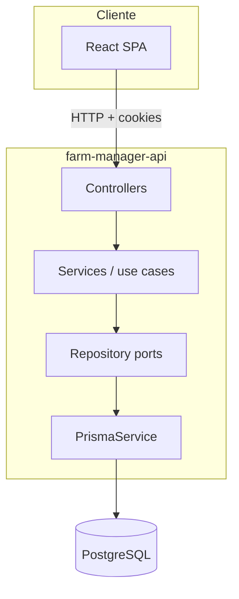

# Arquitetura

**Status:** Fato (código atual) + referências a decisões em `farm-manager-docs`.

## Visão geral

Monólito modular NestJS 11, uma instância, PostgreSQL via Prisma 6. SPA React consome a API REST com cookies httpOnly para auth.

## Camadas no código

| Camada | Responsabilidade | Onde |
|--------|------------------|------|
| Controller | HTTP, validação Zod, Swagger, envelope de resposta | `controllers/` |
| Service | Use case, regras, exceções de negócio | `services/` |
| Repository (port) | Interface + token DI | `repositories/*.repository.ts` |
| Prisma repository | Implementação Prisma | `repositories/prisma-*.repository.ts` |
| DTO Swagger | Documentação OpenAPI | `dtos/` |

Fluxo: **Controller → Service (`execute`) → Repository → Prisma**.

Não há camada `domain/` global — funções puras em `activity/domain/` e `inventory/domain/`; o service é o use case.

## Módulos registrados hoje

Em `src/app.module.ts`:

| Módulo | Contexto aproximado |
|--------|---------------------|
| `AuthModule` | Identity — login, refresh, logout, me |
| `OrganizationModule` | Tenancy — org |
| `FarmModule` | Tenancy — fazendas |
| `MembershipModule` | Tenancy — papéis ADMIN/USER |
| `UserModule` | Identity |
| `EmployeeModule` | People |
| `SupplierModule` | Catalog |
| `ProductModule` | Catalog |
| `UnitOfMeasurementModule` | Catalog |
| `CostCenterModule` | Finance |
| `AccountPlanModule` | Finance |
| `TransactionModule` | Finance |
| `InstallmentModule` | Finance |
| `FieldModule` | Farm Structure — talhões |
| `CropModule` | Farm Structure — culturas e variedades |
| `MachineModule` | Farm Structure — máquinas |
| `CropSeasonModule` | Season — safras, plantings, activate/close stub |
| `PurchaseModule` | Finance + Inventory IN — compras atômicas |
| `InventoryModule` | Inventory — saldos (`GET /stock-balances`), ajustes (`POST /stock-adjustments`) |
| `ActivityModule` | Operations — atividades, OUT + MO + máquina + CostEntry path A |

`src/common/`: `PrismaModule`, `TenancyModule` (global), `ZodValidationPipe`, DTOs de erro para Swagger.

## Alinhamento com bounded contexts

O mapa alvo de contextos e fronteiras está em `farm-manager-docs/04-tecnico/03-api-boundaries.md`. Os módulos Nest atuais são um **subconjunto** do catálogo — Inventory IN/OUT/ADJUSTMENT; CostEntry writers em atividade (insumo, MO, máquina); sem Harvest nem Costing report.

## Implementado vs. planejado (ADRs)

| Capacidade | No código hoje | Planejado (docs/ADRs) |
|------------|----------------|-------------------------|
| Auth JWT cookie | Sim | — |
| `User.platformRole` + `@PlatformAdmin()` | Sim (PR-05.1) | Namespace `/platform/*`, console vendor (PR-18+) |
| Role enum em `User` | Sim (legado; authz de fazenda = Membership) | ADR-013 permissions; remoção PR-18 |
| Tenancy por farm/org | Sim (`@FarmScoped()`, `@FarmId()`, `@OrganizationId()`) | ACL nomeada ADR-013 |
| Field, Crop, Variety, Machine, CropSeason, CropPlanting | Sim (PR-06) | — |
| CostEntry ledger | Parcial (writers path A: insumo, MO, máquina via `POST /activities`) | ADR-006, ADR-007 — relatório PR-13 |
| Inventory desacoplado | Parcial (IN compra, OUT atividade, ADJUSTMENT, `GET /stock-balances`) | ADR-012 |
| Domain event outbox | Não | ADR-015 |
| Ports entre módulos | Parcial (token de repo exportado) | ADR-016 — ports formais |
| Soft delete | Não | — |
| Exception filter global | Não | Erros de domínio estruturados |
| Boundary lint (imports) | Não | `04-architecture-overview.md` |

**Não implementar** RBAC nomeado, outbox ou relatório de custeio em código novo sem PR/ADR explícito — documentar drift se necessário.

## Infra transversal

| Item | Estado |
|------|--------|
| `ConfigModule` + Zod env | Global |
| `ValidationPipe` global | Registrado em `main.ts`, **não usado** para validação |
| Interceptors | Nenhum |
| Middleware | `cookie-parser` |
| Logging | Sem `Logger` estruturado — drift com `console.error` em controllers |
| Prefixo `/api` | Não |
| CORS | `credentials: true`, origem via `CORS_ORIGIN` |

## Referências

- [02-module-anatomy.md](./02-module-anatomy.md)
- `farm-manager-docs/04-tecnico/04-architecture-overview.md`
- `farm-manager-docs/04-tecnico/adr/016-module-contract.md`
